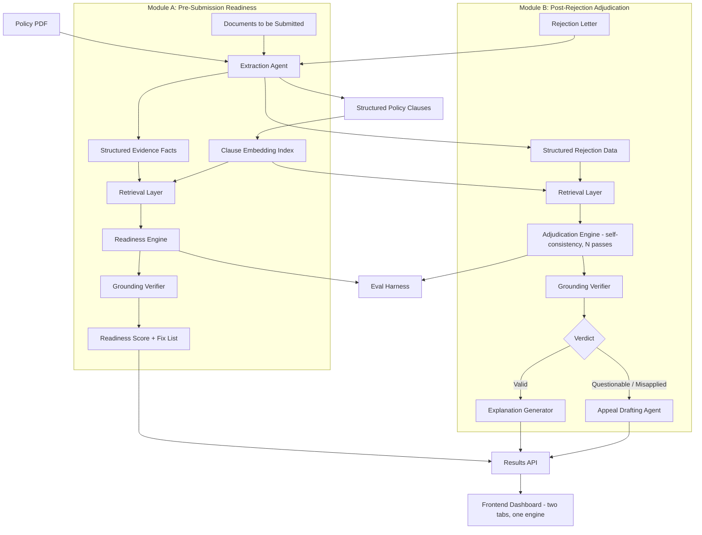

# Claim Advocate — System Architecture

Track 2 — AI-Powered Financial Journeys | 24-hour hackathon format | Team of 2

---

## 1. Project Summary

Claim Advocate is a single reasoning engine applied at two moments in the insurance
claims journey, matching the track brief's own scope ("understanding policy coverage
and submitting documents ... to tracking claims and resolving customer queries"):

- **Module A — Pre-Submission Readiness Check.** Before a customer submits a claim,
  check whether their evidence actually satisfies what the relevant policy clause(s)
  require, and surface a prioritized fix list.
- **Module B — Post-Rejection Adjudication & Appeal.** After a rejection, check
  whether the insurer's stated reason actually holds up against the policy's own
  wording, and draft the appeal if it doesn't.

Both modules share the same Extraction Agent, Clause Embedding Index, and Retrieval
Layer — this is one engine pointed at two moments, not two separate products.

---

## 2. High-level component diagram



---

## 3. Component responsibilities

| Component | Responsibility | Key design decision | Shared / Module-specific |
|---|---|---|---|
| Extraction Agent | Converts policy PDF into structured clauses; converts either submitted documents (Module A) or a rejection letter (Module B) into structured facts | Enforced schema (Pydantic), not freeform text — see §4. One agent, two input types | Shared |
| Clause Embedding Index | Embeds every extracted policy clause, once per case | In-memory vector store is sufficient at this scale | Shared |
| Retrieval Layer | Finds the true best-matching clause(s) for a given set of facts via semantic similarity | Used both to check evidence sufficiency (Module A) and to verify a cited clause (Module B) | Shared |
| Grounding Verifier | Confirms every clause ID and quoted text in any output actually exists in the extracted structure | Programmatic check, not another LLM call — deterministic and fast | Shared |
| Readiness Engine (Module A) | Checks whether submitted evidence satisfies what the matched clause(s) require; flags missing/inconsistent items | Checklist-style reasoning, lighter than adjudication — good fit for the less deep-reasoning-heavy owner | Module A only |
| Adjudication Engine (Module B) | Reasons over retrieved clause(s) vs. claim facts; runs multiple passes for self-consistency confidence | Confidence from pass agreement, not a single guessed number — this is the core differentiator | Module B only |
| Explanation Generator (Module B) | Produces a plain-language explanation when a rejection is valid | Also names any other coverage that might still apply | Module B only |
| Appeal Drafting Agent (Module B) | Generates a formal appeal letter citing only grounded clauses | Template-constrained generation | Module B only |
| Eval Harness | Runs each module's scenario set end-to-end and reports accuracy | One harness, two scenario sets (A and B) | Shared pattern |
| Results API | Exposes endpoints per module plus combined pipeline endpoints | FastAPI, structured JSON throughout | Shared |
| Frontend Dashboard | Two entry points on one page: "Before you submit" (Module A) and "If you're rejected" (Module B) | Same engine, two moments — this is the story the UI should visually tell | Shared shell, module-specific views |

---

## 4. Data schema (core objects)

```python
# Policy clause (post-extraction) — shared by both modules
class Clause(BaseModel):
    clause_id: str
    clause_type: Literal["exclusion", "sub_limit", "waiting_period", "condition", "coverage"]
    raw_text: str
    trigger_conditions: list[str]

# --- Module A: Pre-Submission Readiness ---

class SubmissionEvidence(BaseModel):
    claim_type: str
    facts_provided: list[str]
    documents_provided: list[str]
    claim_date: str | None
    policy_inception_date: str | None

class ReadinessCheck(BaseModel):
    matched_clause_id: str
    requirement_met: bool
    missing_or_inconsistent: list[str]
    explanation: str

class ReadinessResult(BaseModel):
    readiness_score: float          # 0-100, derived from checks passed / total checks
    checks: list[ReadinessCheck]
    prioritized_fixes: list[str]    # ordered by impact
    grounded: bool

# --- Module B: Post-Rejection Adjudication ---

class RejectionRecord(BaseModel):
    cited_clause_ref: str | None
    stated_reason: str
    claim_facts: list[str]
    claim_date: str | None
    policy_inception_date: str | None

class Verdict(BaseModel):
    verdict: Literal["valid", "questionable", "likely_misapplied"]
    confidence: float               # derived from self-consistency agreement
    matched_clause_id: str
    mismatch_explanation: str
    pass_agreement: list[str]       # raw verdicts from each self-consistency pass

class ClaimAdvocateResult(BaseModel):
    verdict: Verdict
    grounded: bool
    explanation: str
    appeal_letter: str | None       # populated only if questionable/likely_misapplied
```

---

## 5. API surface

| Endpoint | Method | Module | Purpose |
|---|---|---|---|
| `/extract-policy` | POST | Shared | Extracts structured clauses from a policy PDF |
| `/readiness/check` | POST | A | Runs retrieval + readiness engine on submission evidence |
| `/readiness/pipeline` | POST | A | Full Module A flow: policy + documents → readiness result |
| `/adjudicate` | POST | B | Runs retrieval + adjudication engine on a rejection |
| `/draft-appeal` | POST | B | Generates appeal letter for a questionable/misapplied verdict |
| `/adjudication/pipeline` | POST | B | Full Module B flow: policy + rejection letter → result |
| `/eval/run` | POST | Both | Runs both scenario sets through their respective pipelines, returns accuracy metrics |

---

## 6. Tech stack

| Layer | Choice | Why |
|---|---|---|
| LLM calls | Groq-hosted model via API | Fast inference makes multi-pass self-consistency (Module B) and dual-module load cheap in wall-clock time |
| Orchestration | LangChain (or plain structured calls — keep it thin) | Familiar, fast to wire up; avoid over-abstracting for a 24-hour build |
| Embeddings | sentence-transformers (local) or provider embedding endpoint | No need for a hosted vector DB at this scale |
| Backend | FastAPI | Fast to scaffold, native Pydantic validation matches the schema design |
| PDF parsing | pdfplumber / PyPDF | Sufficient for structured, machine-generated sample documents |
| Frontend | React + Vite | Fast dev loop; two-tab layout maps cleanly to two modules |
| Storage | In-memory / SQLite | No need for a persistent DB in a 24-hour scope |

---

## 7. Ownership split (team of 2)

| Owner | Builds |
|---|---|
| Person 1 | Adjudication Engine, Grounding Verifier, Appeal Drafting Agent (Module B) — kept with one owner so reasoning logic stays coherent |
| Person 2 | Readiness Engine, fix-list generator (Module A), plus Frontend |
| Together | Extraction Agent, Clause Embedding Index, Retrieval Layer (shared core, built first, schema locked before splitting) |

---

*See `plan.md` for the feature feasibility breakdown, two-person phase-by-phase build
schedule, and risk register.*