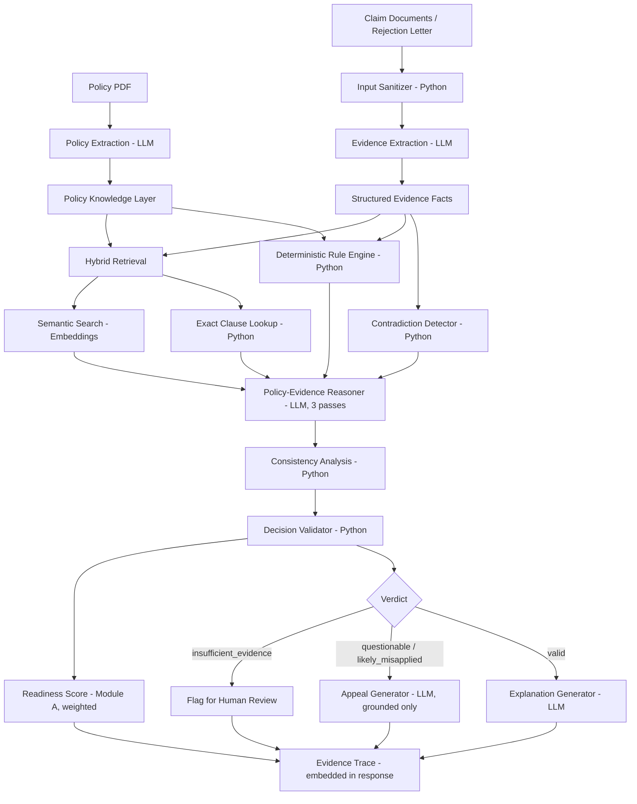

# Claim Advocate — System Architecture

Track 2 — AI-Powered Financial Journeys | 24-hour hackathon format | Team of 2

---

## 0. What changed in this revision

A detailed alternative architecture was reviewed and selectively merged in. Adopted:
deterministic rule engine, contradiction detection, prompt-injection/security handling,
a fourth verdict (`insufficient_evidence`), hybrid retrieval (exact clause lookup +
semantic search combined), weighted readiness scoring, a lightweight evidence trace
embedded directly in pipeline responses, and renaming "confidence" to
`consistency_score` with an explicit disclaimer that it measures reasoning agreement,
not probability of correctness. Every component below is now labeled **Python
(deterministic)** or **LLM (reasoning)** so the split is explicit and defensible.

Deliberately left out: a structured clause-hierarchy/related-clause graph, a fully
decomposed 10-part validator (collapsed into one focused function), a separate
`/trace/{id}` endpoint with persistence, and 5-pass self-consistency (kept at 3).
These added extraction risk or infrastructure without a matching demo payoff or
judge-question answer — see `plan.md` §0 for the same reasoning applied to scope.

---

## 1. Project Summary

Claim Advocate is one policy-grounded reasoning engine used at two moments in the
insurance claims journey, matching the track brief's own scope:

- **Module A — Pre-Submission Readiness.** Before submitting a claim, check whether
  the evidence provided satisfies policy requirements, catch contradictions between
  documents, and produce a weighted readiness score + prioritized fix list.
- **Module B — Post-Rejection Adjudication & Appeal.** After a rejection, check
  whether the insurer's stated reason actually holds up against the policy's own
  wording. Produce one of `valid` / `questionable` / `likely_misapplied` /
  `insufficient_evidence`, and draft a grounded appeal when appropriate.

Both modules share the same Extraction Agent, Policy Knowledge Layer, Retrieval Layer,
Deterministic Rule Engine, Contradiction Detector, and Decision Validator. The system
is decision-support, not a legally binding adjudicator — this is stated in the UI.

Guiding principle, kept from the original design: `LLM → proposed reasoning →
deterministic validation → final result`. The LLM never gets the final word alone.

---

## 2. High-level component diagram



---

## 3. Component responsibilities

| Component | Responsibility | Python or LLM | Shared / Module A / Module B |
|---|---|---|---|
| Input Sanitizer | Wraps extracted document text in clearly delimited blocks before it reaches any LLM prompt; treats document content as data, never as instructions | Python | Shared |
| Policy Extraction | Converts policy PDF into structured `Clause` objects | LLM | Shared |
| Evidence Extraction | Converts claim documents or a rejection letter into structured `EvidenceFact` / `RejectionRecord` objects, with normalized dates/amounts | LLM | Shared |
| Policy Knowledge Layer | Stores clauses with `clause_id`, type, raw text, trigger conditions, page number, embedding — not one flattened blob | Python (storage) | Shared |
| Contradiction Detector | Compares normalized structured facts field-by-field (dates, amounts, hospital, identity, policy/claim number) and flags conflicts with neutral language ("inconsistent," not "fraudulent") | Python | Shared |
| Deterministic Rule Engine | Date/waiting-period/deadline math, monetary limit and sub-limit checks, document-presence checks — anything plain code computes reliably | Python | Shared |
| Hybrid Retrieval — Exact Lookup | Direct `clause_id` lookup when a rejection cites a specific clause | Python | Module B primarily |
| Hybrid Retrieval — Semantic Search | Embedding similarity search for conceptually relevant clauses when no exact reference exists, or to surface related coverage | Embeddings (not LLM reasoning) | Shared |
| Policy-Evidence Reasoner | The one genuinely irreducible reasoning step — interprets whether retrieved clause wording actually covers the claim facts; runs 3 independent passes | LLM | Module B (adjudication) / Module A (ambiguous requirement matching only) |
| Consistency Analysis | Tallies agreement across the 3 reasoning passes into a `consistency_score` — explicitly NOT a probability of correctness, just agreement rate | Python | Module B |
| Decision Validator | One focused function checking: cited clause/fact IDs exist, quoted text matches source, deterministic rules satisfied, no unresolved high-severity contradictions, evidence supports the verdict | Python | Shared |
| Explanation Generator | Plain-language explanation when verdict is `valid`; also names any other coverage that might still apply | LLM | Module B |
| Appeal Generator | Formal appeal letter — only from clauses/facts that passed the Decision Validator; builds an evidence table before the letter text | LLM (grounded inputs only) | Module B |
| Readiness Engine | Weighted readiness score (critical requirements weighted higher than optional evidence) + prioritized fix list | Python (scoring) + LLM (ambiguous requirement interpretation) | Module A |
| Evidence Trace | `verdict → clause_id → fact_id → source document → page`, embedded directly in the pipeline response, not a separate persisted endpoint | Python (assembly) | Shared |
| Eval Harness | Runs the scenario set through both pipelines, reports real accuracy numbers, labels anything unmeasured as `NOT YET MEASURED` | Python | Shared |

---

## 4. Data schemas (core objects)

```python
# --- Policy Knowledge Layer ---
class Clause(BaseModel):
    clause_id: str
    clause_type: Literal["exclusion", "sub_limit", "waiting_period", "condition", "coverage"]
    raw_text: str
    trigger_conditions: list[str]
    page_number: int | None

# --- Evidence Layer ---
class EvidenceFact(BaseModel):
    fact_id: str
    field: str                  # e.g. "admission_date", "invoice_amount"
    value: str                  # normalized (ISO dates, numeric amounts)
    source_document: str
    page: int | None
    confidence: float

class ContradictionFlag(BaseModel):
    field: str
    value_a: str
    source_a: str
    value_b: str
    source_b: str
    severity: Literal["low", "medium", "high"]
    note: str                   # neutral language, e.g. "requires verification"

class RuleResult(BaseModel):
    rule_name: str               # e.g. "waiting_period_check"
    passed: bool
    explanation: str

# --- Module A ---
class SubmissionEvidence(BaseModel):
    claim_type: str
    facts: list[EvidenceFact]
    documents_provided: list[str]

class ReadinessResult(BaseModel):
    readiness_score: float       # weighted: critical 50% / required evidence 30% / consistency 15% / supporting 5%
    rule_results: list[RuleResult]
    contradictions: list[ContradictionFlag]
    missing_evidence: list[str]
    prioritized_fixes: list[str]
    grounded: bool
    scoring_model_note: str = "Prototype weighted scoring model — not a certified readiness determination."

# --- Module B ---
class RejectionRecord(BaseModel):
    cited_clause_ref: str | None
    stated_reason: str
    claim_facts: list[EvidenceFact]

class Verdict(BaseModel):
    verdict: Literal["valid", "questionable", "likely_misapplied", "insufficient_evidence"]
    consistency_score: float     # agreement across reasoning passes — NOT a probability
    matched_clause_id: str | None
    mismatch_explanation: str
    pass_results: list[str]      # raw verdict from each of the 3 reasoning passes

class ClaimAdvocateResult(BaseModel):
    verdict: Verdict
    contradictions: list[ContradictionFlag]
    rule_results: list[RuleResult]
    grounded: bool
    explanation: str
    appeal_letter: str | None    # only populated if grounded and verdict warrants it
```

---

## 5. API surface

| Endpoint | Method | Purpose |
|---|---|---|
| `/extract-policy` | POST | Policy PDF → structured `Clause[]` |
| `/extract-evidence` | POST | Claim documents or rejection letter → `EvidenceFact[]` / `RejectionRecord` |
| `/readiness/pipeline` | POST | Full Module A flow → `ReadinessResult`, including embedded evidence trace |
| `/adjudicate` | POST | Retrieval + rule engine + reasoning + validation → `Verdict` |
| `/draft-appeal` | POST | Grounded `Verdict` → appeal letter (evidence table first, then letter text) |
| `/adjudication/pipeline` | POST | Full Module B flow → `ClaimAdvocateResult`, including embedded evidence trace |
| `/eval/run` | POST | Runs both scenario sets, returns real accuracy metrics or `NOT YET MEASURED` |

Evidence trace is returned as a field within the pipeline responses above, not via a
separate `/trace/{id}` endpoint — no persistence layer needed for this to work.

---

## 6. Tech stack

| Layer | Choice | Why |
|---|---|---|
| LLM calls | Groq-hosted model via API | Fast inference keeps 3-pass self-consistency and the reduced LLM footprint cheap in wall-clock time |
| Deterministic logic | Plain Python (dates, thresholds, contradiction comparisons) | No LLM call for anything code computes reliably — faster, cheaper, and a concrete answer to "isn't this just a wrapper?" |
| Embeddings | sentence-transformers (local) | No hosted vector DB needed at this scale |
| Backend | FastAPI + Pydantic | Structured validation matches the schema design directly |
| PDF parsing | pdfplumber | Per-page extraction, needed for page numbers in the evidence trace |
| Frontend | React + Vite | Two-tab layout, "Why?" trace view as a prominent interaction |
| Storage | In-memory / SQLite | No persistent DB required — evidence trace is embedded in responses, not stored |

---

## 7. Ownership split (team of 2)

| Owner | Builds |
|---|---|
| Person 1 | Policy-Evidence Reasoner, Consistency Analysis, Decision Validator, Appeal Generator (Module B core) |
| Person 2 | Readiness Engine, Contradiction Detector, Rule Engine application for Module A, Frontend |
| Together | Extraction Agents, Policy Knowledge Layer, Hybrid Retrieval, Deterministic Rule Engine (shared logic), Input Sanitizer, schema — locked before splitting |

---

*See `plan.md` for the feature feasibility breakdown, phase-by-phase build schedule,
and risk register.*